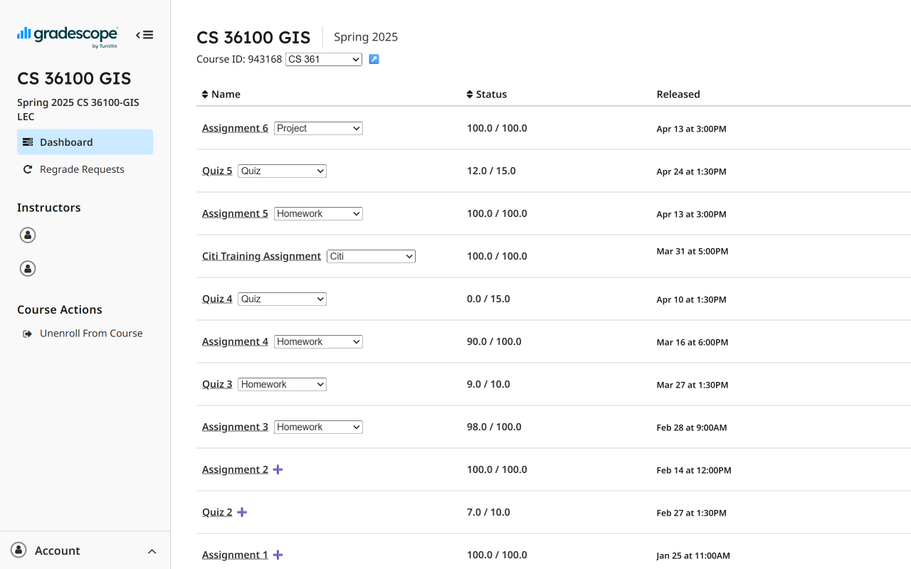

# Gradebook

Browser extension to stay on top of your grades.

Download on the [Chrome Web Store](https://chromewebstore.google.com/detail/mlipmbmigplkjkladdggbikhfcibcdbm)
and [Firefox Addon store](https://addons.mozilla.org/en-US/firefox/addon/gradebook/)!

## Features
- Consolidate grades from Brightspace, Gradescope, or enter manually
- Track your current grade
  - What percentage of my final grade is one homework worth?
  - How well am I doing in the quizzes category?
- Estimate grades post-curve
  - What will be my grade if the average is curved to a B-?
- Run hypotheticals
  - What grade do I need on the final to get a B?
  - How will my grade be affected if I get 90% on all future homeworks?





## Developing

```bash
pnpm install
pnpm dev
```

## Attribution
- Graphics Title: 1f4af.svg
  - Graphics Author: Copyright 2020 Twitter, Inc and other contributors (https://github.com/twitter/twemoji)
  - Graphics Source: https://github.com/twitter/twemoji/blob/master/assets/svg/1f4af.svg
  - Graphics License: CC-BY 4.0 (https://creativecommons.org/licenses/by/4.0/)
- Graphics Title: 1f4d6.svg
  - Graphics Author: Copyright 2020 Twitter, Inc and other contributors (https://github.com/twitter/twemoji)
  - Graphics Source: https://github.com/twitter/twemoji/blob/master/assets/svg/1f4d6.svg
  - Graphics License: CC-BY 4.0 (https://creativecommons.org/licenses/by/4.0/)
- Bell Curve icon
  - Author: [Muhammad_Usman](https://www.freepik.com/author/muhammad-usman/icons) on
  [freepik](https://www.freepik.com/icon/bell-curve_7665216)
